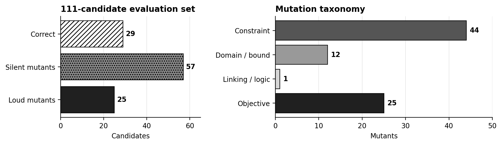

# SilentOR — Experiment 2

This folder is a reviewer-facing record of Experiment 2. It keeps the 29 source problems, 111 controlled candidate models, requirement catalog, verification methods, result files, figures, prompts, and exact run archives together without rewriting the original data.

## Research question

Can solver-backed, requirement-level verification detect and localize mathematical-modeling errors that objective-value comparison or direct language-model inspection misses?

An optimization model can return the reference objective while still be mathematically wrong: a constraint may be relaxed, a variable domain weakened, or a linking relation broken without changing the optimum. EXP2 separates those **silent** formulation errors from **loud** objective-changing errors.

## Benchmark at a glance

- 111 candidates across 29 optimization problems
- 29 certified correct base models
- 82 controlled mutants
- 57 silent mutants: 44 constraint misspecifications, 12 domain/bound errors, and 1 linking/logic error
- 25 loud objective-accounting mutants
- 523 active mathematical requirements in the 29-problem catalog

## Three verification approaches

1. [Direct Detector](./methods/direct_detector.md): problem description plus candidate model.
2. [Detector + Requirement List](./methods/detector_requirement_list.md): the same input plus the requirement decomposition.
3. [SilentOR](./methods/silentor.md): requirement-level template selection, executable probe generation, validation, solver execution, probe-aware witness review, and root-cause localization.

## Results

The complete comparison is in [results/README.md](./results/README.md). Gemma Direct/Requirement-List runs contain 111 rows each. **Gemma SilentOR is incomplete: 95/111 rows are present, and 90 are valid for the reported policy scores.**

For the reported valid-row `probe_aware_root` policy, Gemma reaches 77.42% detection, 50.00% FPR, 33.87% primary exact localization, and 43.18% silent exact localization on its partial valid subset. Exact localization is diagnosis/scoring only.

## Browse the artifact

- [Problems and authoritative data](./benchmark/README.md)
- [Candidate models and mutation manifests](./candidates/README.md)
- [Requirements and variable meanings](./requirements/README.md)
- [Probe templates](./probe_templates/README.md)
- [Methods](./methods/README.md)
- [Results and completeness status](./results/README.md)
- [Figures](./figures/README.md)
- [Configurations](./configs/README.md)
- [Prompt sources](./prompts/README.md)
- [Exact configuration/prompt source files](./configs_prompts/README.md)
- [Reproduction instructions](./reproduction/README.md)
- [Exact original run/code artifacts](./original_artifacts/README.md)
- [GitHub upload instructions](./UPLOAD_INSTRUCTIONS.md)

## Source-of-truth policy

CSV and JSON files are the numerical source of truth. Markdown and figures are presentation layers. Exact copied files are hash-audited in [original_artifacts/SOURCE_HASHES.csv](./original_artifacts/SOURCE_HASHES.csv); derived files are explicitly labelled.
