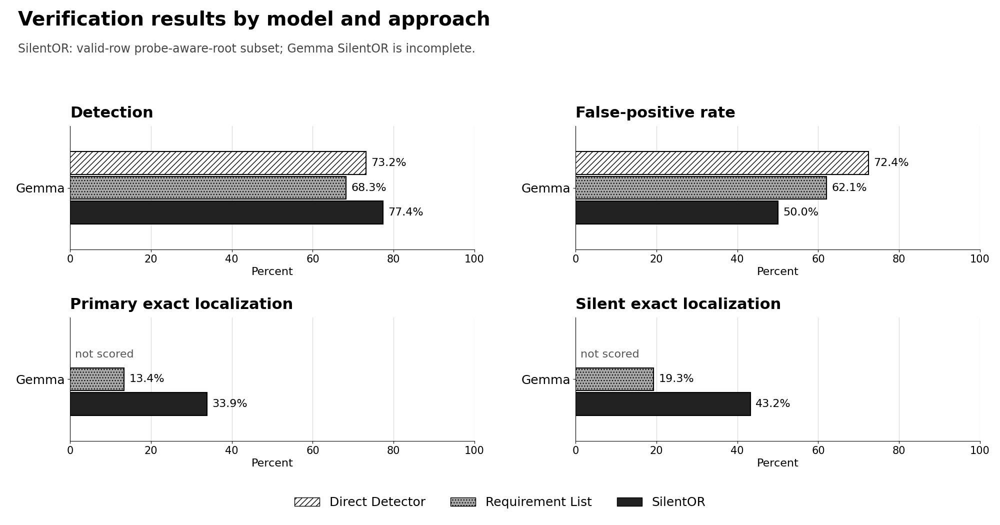

# EXP2 results

The machine-readable source of truth is the exact source CSVs and archived run folders below. Figures are presentation views only.

## Track-A-miss recovery

On matched valid rows, SilentOR detected 8 of 22 Gemma misses (36.36%). This crossover is a partial matched subset because the Gemma SilentOR run is incomplete.

## Exact result files

- Gemma: [Direct Detector](./gemma/direct_detector/results.csv), [Requirement List](./gemma/requirement_list/results.csv), [SilentOR compact scores](./gemma/silentor/)
- Complete source run archives, including raw traces and the large SilentOR `results.csv` files: [original artifacts](../original_artifacts/runs/)

